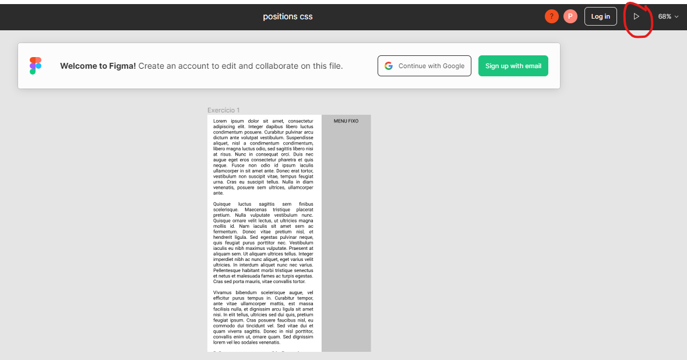

# Exercícios Position CSS - Prazo para entrega 29/10

1. Criar página que contém uma seção para armazenar 6 parágrafos e uma area na lateral direita fixa.

Requisitos: 

* A seção principal deve ter um tamanho máximo de 600px
* O texto dos parágrafos da seção deve ter uma fonte de 22px
* O texto deve esta justificado
* Cada parágrafo deve conter um espaçamento em cima e embaixo de 10px
* O menu lateral deve conter 200px e estar fixo conforme layout no [figma](https://www.figma.com/file/gM0jRSHthkhaxvrgJLi4Sy/positions-css?node-id=0%3A1)
* O menu lateral deve conter o texto "MENU LATERAL" que deve estar centralizado na horizontal e com espaçamento do topo de 15px

OBS: Para visualizar como a página deve se comportar com scroll basta clicar no botão de present no figma conforme imagem abaixo

2. Montar página com imagem centralizada na horizontal e vertical com tamanho de 300px de largura. A imagem deve conter uma legenda que fique posicionada no topo esquerdo com espaçamento em cima e na lateral esquerda de 10px.

Pode ser utilizada qualquer imagem do link a seguir https://drive.google.com/file/d/1IhaGdetmz9QqClQ5Zw_tMp28QLHZ9NPJ/view?usp=sharing

O layout com resultado esperado pode ser consultado no link https://www.figma.com/file/gM0jRSHthkhaxvrgJLi4Sy/positions-css?node-id=1%3A16

3. Criar 5 quadrados de 100px cada e atribuir um background que posibilite a visualização do quadrado. 4 quadrados deveem ficar posicionados nas extremidades da página com espaçamento de 10px para os lados que fiquem paralelos a página. A quinta caixa deve ficar centralizada tanto na horizontal como na vertical com relação a página. 

O resultado esperado pode ser encontrado no link https://www.figma.com/file/gM0jRSHthkhaxvrgJLi4Sy/positions-css?node-id=5%3A21